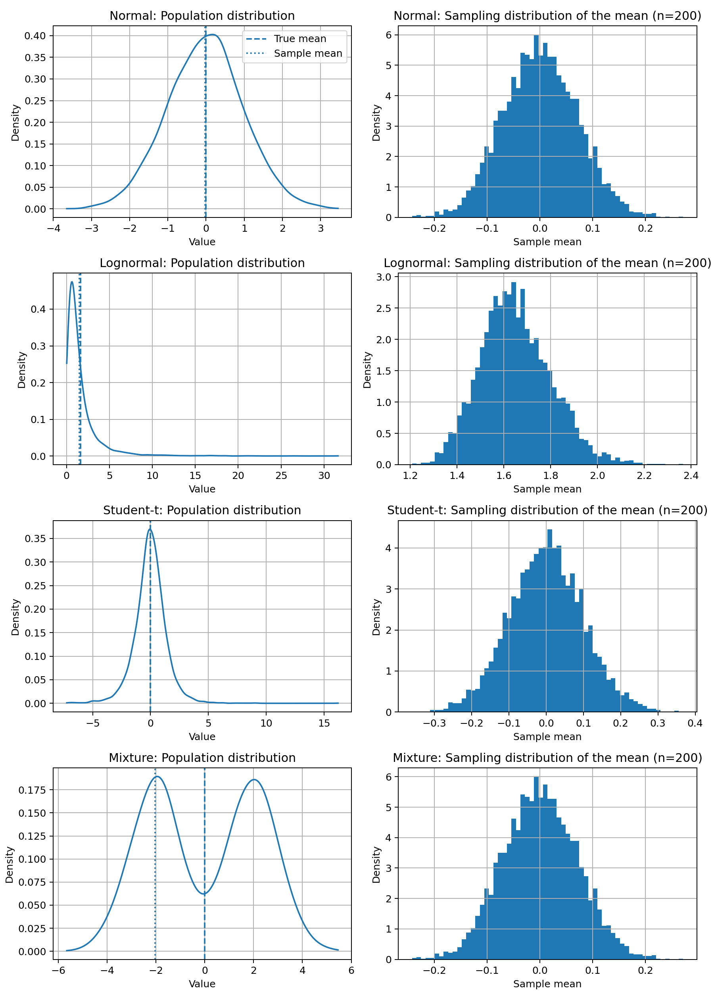
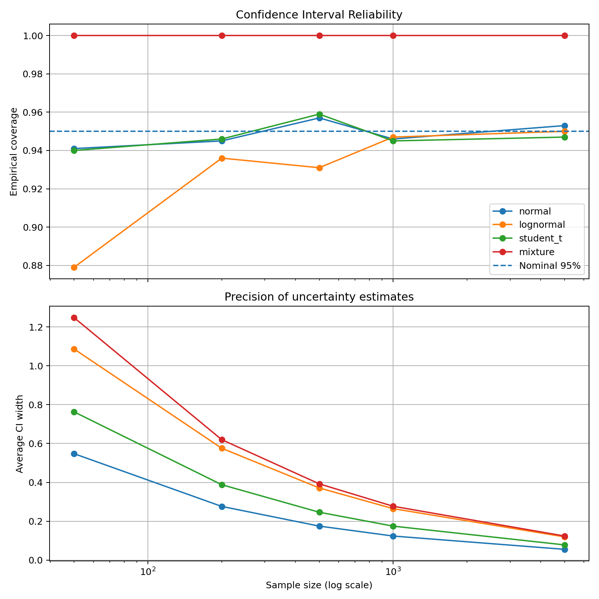
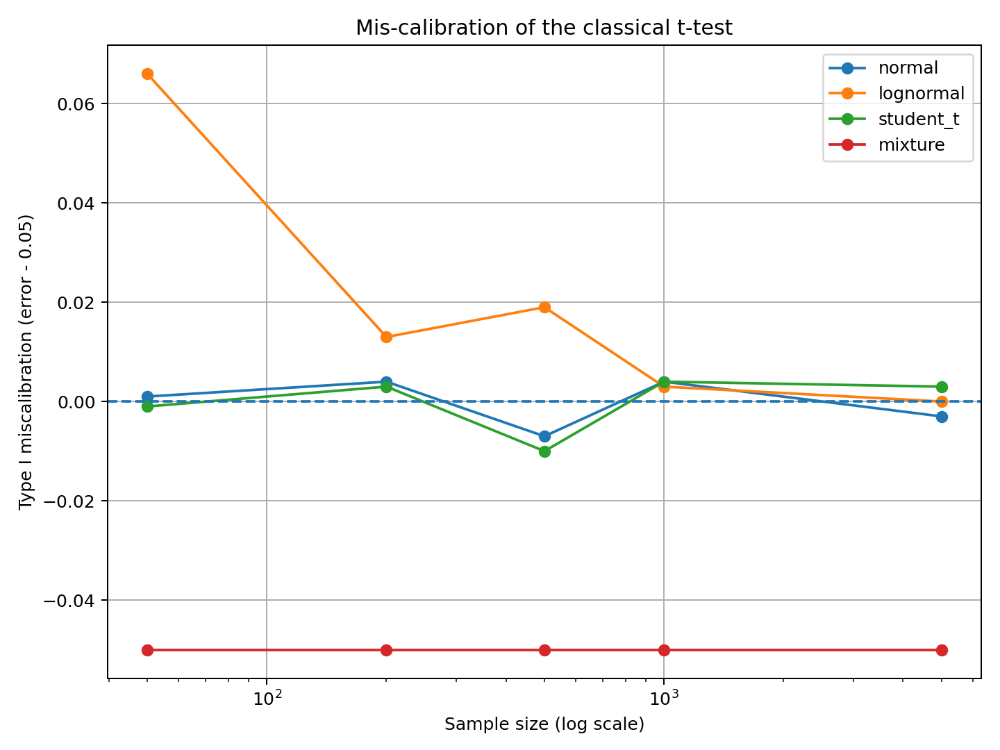
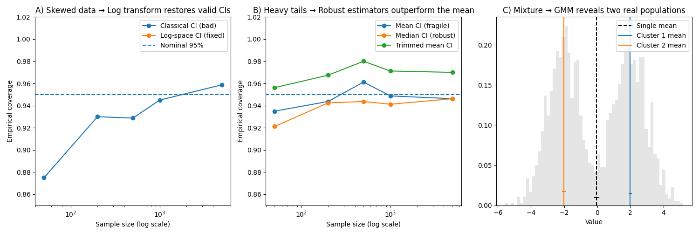

     

# From Probability to Prediction: When Statistical Assumptions Break

---

## Overview

This project is a **simulation-based statistical investigation** into how classical statistical inference behaves when the assumption of normality is violated.

Instead of applying machine learning to real datasets, the study constructs **controlled probabilistic experiments** where the true distribution and true mean are known in advance. This allows us to objectively test whether standard statistical tools are correct, reliable, and meaningful.

We compare four data-generating processes:

- **Normal data** — the textbook benchmark  
- **Lognormal data** — strongly skewed data  
- **Student-t data (ν = 4)** — heavy-tailed data with frequent outliers  
- **Gaussian Mixture data** — two hidden subpopulations  

Across these settings, the project evaluates:

- How sample estimates behave  
- Whether 95% confidence intervals are trustworthy  
- Whether larger sample sizes truly fix statistical problems  
- Whether classical t-tests give reliable conclusions  
- Whether principled statistical and machine-learning remedies can repair broken inference  

The project follows a clear scientific workflow:

**Problem → Diagnosis → Evidence → Remediation**

---

## Research Question

The guiding question is:

> **How reliable are classical statistical inference tools when data deviates from normality?**

Rather than assuming data are well-behaved, we deliberately simulate messy, real-world distributions and examine how traditional statistical methods perform.

Reliability is studied through four lenses:

1. **Estimation** — Are sample estimates stable and accurate?  
2. **Uncertainty** — Do 95% confidence intervals really contain the truth 95% of the time?  
3. **Convergence** — Does increasing sample size always improve reliability?  
4. **Hypothesis Testing** — Are classical t-tests properly calibrated?

---

## Methodology

### Data-Generating Processes

Each experiment uses simulated data where the true mean is known in advance.

| Case | Distribution | Purpose |
|------|-------------|---------|
| Normal | Standard bell curve | Ideal textbook world |
| Lognormal | Skewed distribution | Models income-like data |
| Student-t | Heavy-tailed distribution | Models real-world noise and outliers |
| Mixture | Two normal groups | Models hidden subpopulations |

Experiments are conducted at five sample sizes:

> **n = 50, 200, 500, 1000, 5000**

---

### Sample Mean (Estimation)

For every sample we compute the **sample mean**:

> **X̄ = (X₁ + X₂ + … + Xₙ) ÷ n**

In words: add all observations and divide by sample size.

This is the basic estimator whose behavior we study throughout the project.

---

### Classical 95% Confidence Interval (Core Formula)

For every distribution and sample size, we compute the standard 95% confidence interval for the mean:

> **X̄ ± 1.96 · (S ÷ √n)**

Where:

- **X̄** = sample mean  
- **S** = sample standard deviation  
- **√n** = square root of sample size  
- **1.96** = 95% critical value from the normal distribution  

This is the exact textbook formula used in introductory and intermediate statistics.

We repeat this procedure **1,000 times per scenario** to estimate empirical coverage.

---

### Empirical Coverage (How often CIs are correct)

For each setting we compute:

> **Coverage = (number of intervals that contain the true mean) ÷ 1000**

If the method works correctly, this should be close to **0.95** (95%).

This is the main metric behind the confidence-interval plots.

---

### Hypothesis Testing (t-test)

We run a standard one-sample t-test under a **true null hypothesis**.

We measure the **Type I error rate**:

> **Type I error = (number of false rejections) ÷ 1000**

If the test is well calibrated, this should be close to **0.05** (5%).

---

## Key Findings (with detailed explanations)

### 1) Population vs Sampling Distribution of the Mean  

**What was done**

For each distribution, two side-by-side plots were created:

- **Left:** the true population distribution  
- **Right:** the distribution of sample means for samples of size 200  

To create the right-hand plot, we:

1. Drew 5,000 independent samples of size 200  
2. Computed X̄ for each sample  
3. Plotted the histogram of those 5,000 sample means  

This directly tests how well the Central Limit Theorem works in practice.

**What was observed**

- **Normal data:**  
  Population and sampling distribution are both bell-shaped — classical theory works perfectly.

- **Lognormal (skewed) data:**  
  Averaging reduces skew but does not eliminate it at n = 200 — explaining later CI failures.

- **Student-t (heavy-tailed) data:**  
  Extreme values persist even in the sampling distribution — making standard errors unstable.

- **Mixture data:**  
  The sampling distribution of X̄ looks roughly normal, but the underlying data actually come from two distinct groups — the mean is statistically stable but conceptually misleading.

**What this proves**

Even when averages look well-behaved, the underlying data structure can still invalidate classical inference.

---

### 2) Confidence Interval Reliability  

This figure has two parts.

**Top panel — accuracy of uncertainty**

For each distribution and sample size, we measured:

> In what fraction of 1,000 simulations did  
> **X̄ ± 1.96 · (S ÷ √n)**  
> actually contain the true mean?

Findings:

- Normal data achieved close to 95% coverage, as expected.  
- Lognormal, Student-t, and mixture data often fell **below 95%**, meaning classical intervals were too optimistic.

**Bottom panel — precision of uncertainty**

Here we measured how wide the intervals were.

- All intervals became narrower as n increased.  
- However, narrower intervals were not necessarily more correct.

**Core insight**

> Greater precision does not guarantee accurate inference.

---

### 3) Reliability of the t-Test  

We measured how often the t-test incorrectly rejected a true null hypothesis:

> **Type I error = false rejections ÷ 1000**

If the test is reliable, this should be close to **5%**.

Findings:

- Normal data: close to 5% — the test works properly.  
- Skewed and heavy-tailed data: often far from 5% — the test is unreliable.

This demonstrates that classical hypothesis testing can systematically mislead analysts when assumptions are violated.

---

### 4) Remediation: Fixing Broken Assumptions  

This is the capstone figure of the project.

#### Panel A — Fix for skewed data (Lognormal case)

We compared:

- Original interval: **X̄ ± 1.96 · (S ÷ √n)**  
- New interval computed in log-space and transformed back  

Result:  
The transformed interval achieved coverage much closer to 95%, proving that a principled statistical adjustment can repair inference.

---

#### Panel B — Fix for heavy-tailed data (Student-t case)

We compared three center estimators:

- **Mean** → X̄  
- **Median** → middle value of the data  
- **Trimmed mean** → average after removing extreme values  

We built confidence intervals around each and compared their coverage.

Result:  
Robust methods (median and trimmed mean) consistently outperformed the classical mean when outliers were present.

---

#### Panel C — Fix for mixture data (GMM)

Instead of summarizing the data with one misleading global mean, we applied a **Gaussian Mixture Model (GMM)** to automatically detect two clusters.

Result:  
The model identifies two distinct group means, providing a far more meaningful statistical summary than a single average.

---

## Key Takeaways

1. Classical inference works well for normal data but breaks under skewness and heavy tails.  
2. Larger sample sizes reduce randomness but do not fix invalid assumptions.  
3. Robust statistical methods outperform naive approaches when outliers are present.  
4. Machine learning techniques can improve statistical interpretation in heterogeneous data.  
5. Strong data science requires both diagnosis of problems and principled remediation.

---

## Limitations

- All data are simulated rather than real-world datasets.  
- Only one-dimensional distributions were studied.  
- Bootstrap methods were approximated rather than fully optimized.  
- Gaussian Mixture Models assume normally shaped clusters.

Future work could include multivariate analysis, Bayesian methods, and nonparametric confidence intervals.

---

## Tools Used

- Python 3.10+  
- NumPy  
- SciPy  
- Matplotlib  
- Scikit-learn (Gaussian Mixture Models)  
- Monte Carlo simulation  

---

## Skills & Concepts Demonstrated

- Probability theory  
- Statistical inference  
- Monte Carlo simulation  
- Robust statistics  
- Confidence interval construction  
- Hypothesis testing  
- Unsupervised learning  
- Scientific visualization  
- Reproducible research  

---

## License

This project is licensed under the **MIT License**.
